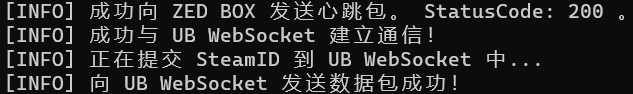
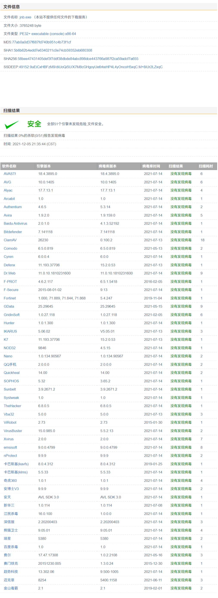
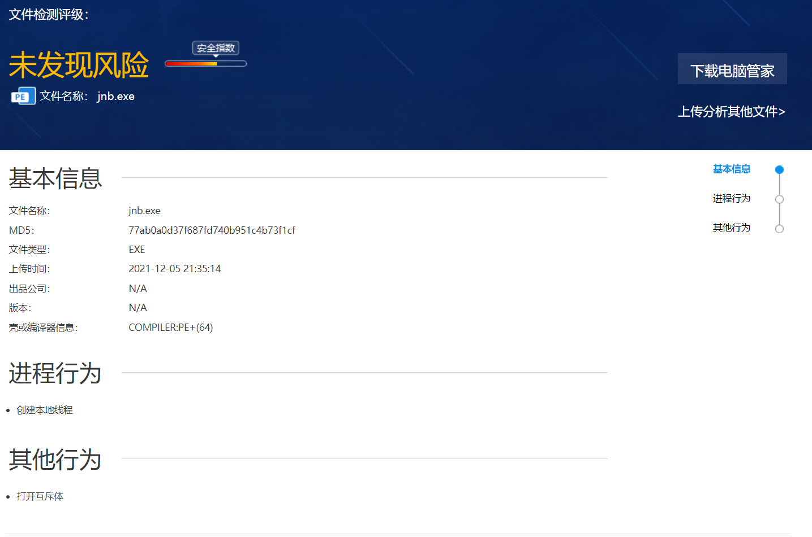

# JnB - Just need Bonus

我们只想要奖励 ~~(白嫖~~

### 支持社区

|      社区      | 是否支持 |
| :------------: | :------: |
| 僵尸乐园 - ZED |    ✔️     |
|  UB社区 - UB   |    ✔️     |
|  X社区 - 93x   |    ❌     |
|  风云社 - fys  |    ❌     |

### 📥 下载链接
|   📃 文件   |                           🐙 GitHub RAW                           |                                🚀 CDN 加速                                 |
| :--------: | :--------------------------------------------------------------: | :-----------------------------------------------------------------------: |
|  jnb.exe   |  [点我下载](https://github.com/bemarkt/JnB/raw/master/jnb.exe)   | [点我起飞](https://raw.githubusercontents.com/bemarkt/JnB/master/jnb.exe) |
| steam.toml | [点我下载](https://github.com/bemarkt/JnB/raw/master/steam.toml) |   [点我起飞](https://cdn.jsdelivr.net/gh/bemarkt/JnB@latest/steam.toml)   |

### 使用方法

1. 下载 `jnb.exe`, `steam.toml` 到同一目录下。

2. 打开 `steam.toml` 填入相应 SteamID。

> 可使用 [SteamIO](https://steamid.io/) 进行查询

|    Key    |       Value       |                        解释                         |
| :-------: | :---------------: | :-------------------------------------------------: |
|  steamid  | STEAM_x:y:zzzzzz  |                     填入SteamID                     |
| steamid64 | 7656119xxxxxxxxxx |                   填入64位SteamID                   |
| steamid3  |     xxxxxxxx      | 填入SteamID3尾部数字，如 \[U:1:xxxxxx\] 中的 xxxxxx |

3. 运行 `jnb.exe` ，开始享受 ~ ~

### 程序安全检测

MD5: 77ab0a0d37f687fd740b951c4b73f1cf

#### Virscan 

  

  
点我展开查看

  

#### 腾讯哈勃

  

  
点我展开查看

  

